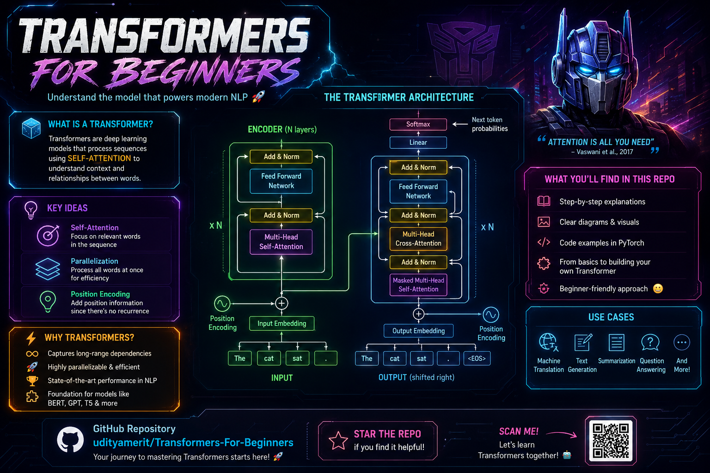
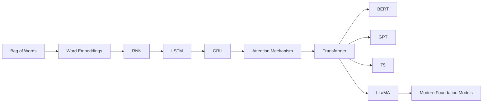
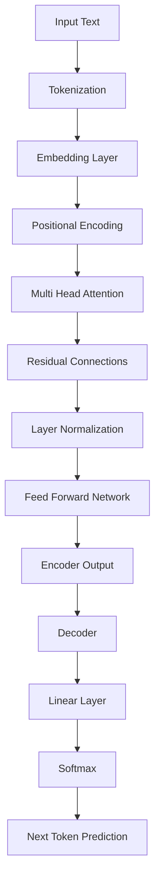
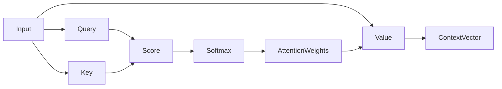
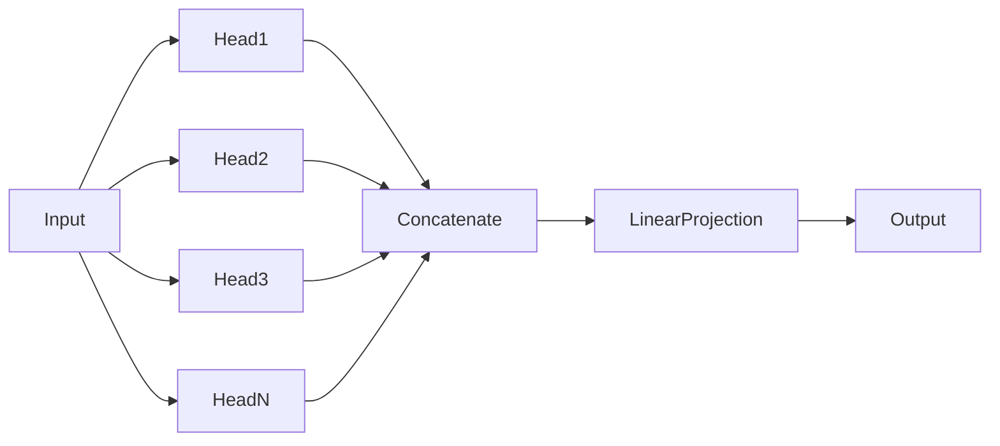
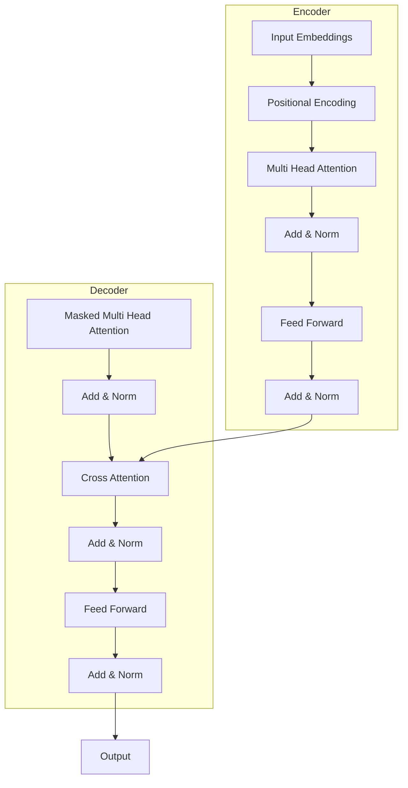
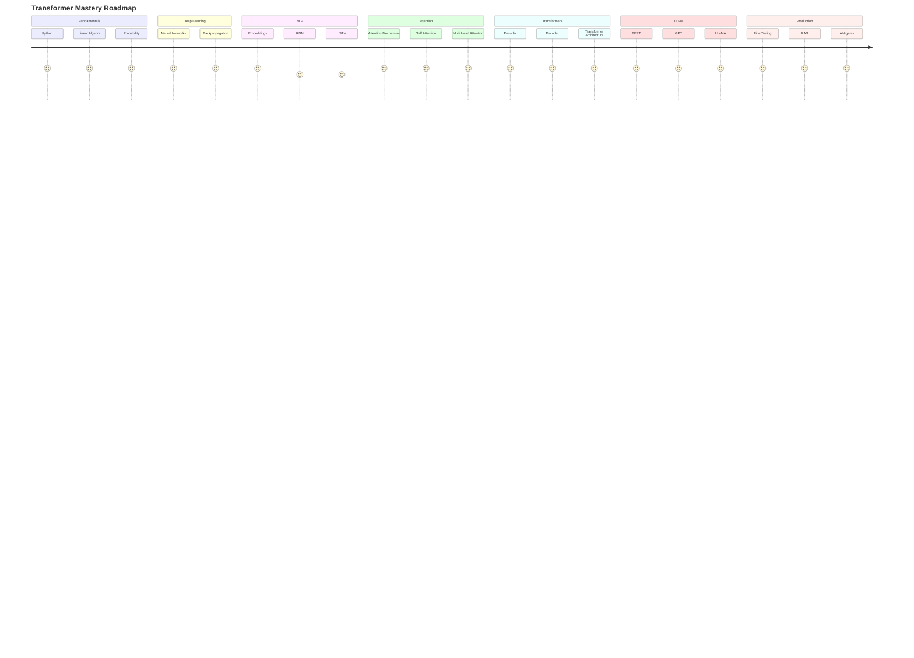
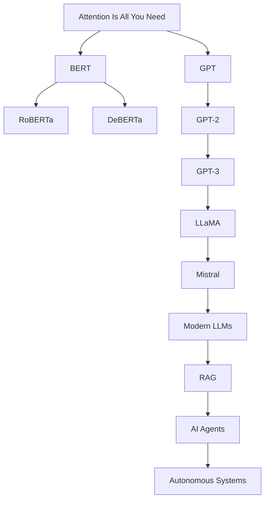

<div align="center">

# 🚀 Transformers For Beginners

### A Complete Research-Oriented Guide to Understanding Transformers, Attention Mechanisms, Large Language Models, and Modern Generative AI

<p align="center">


</p>

<p align="center">


</p>

<p align="center">
  
</p>

</div>

---

# 📖 Overview

Transformers For Beginners is a comprehensive, research-oriented repository designed to help students, developers, and AI enthusiasts understand Transformer architectures from first principles to modern Large Language Models (LLMs). This repository combines detailed handwritten notes, mathematical explanations, visual workflows, and practical insights to build a strong foundation in Attention Mechanisms, Self-Attention, Multi-Head Attention, Layer Normalization, Encoders, Decoders, and Output Layers.

The content follows a structured learning path inspired by the original Attention Is All You Need paper and extends to modern architectures such as BERT, GPT, T5, LLaMA, and Mistral. Along with theoretical concepts, the repository provides research paper references, architecture diagrams, implementation guidance, and curated resources for deeper exploration.

Whether you are preparing for interviews, learning NLP, studying Deep Learning, or exploring Generative AI, this repository serves as a complete roadmap for mastering Transformers and understanding the technology powering today's most advanced AI systems.

This repository provides a comprehensive journey from:

- Attention Mechanisms
- Self-Attention
- Multi-Head Attention
- Positional Encoding
- Encoder-Decoder Architectures
- Transformer Mathematics
- Large Language Models
- Fine-Tuning
- Retrieval-Augmented Generation (RAG)
- AI Agents

The goal is to help learners understand not only **how Transformers work** but also **why they became the foundation of modern AI systems.**

<p align="center">
  
</p>
---

# 🎯 Project Objectives

✅ Learn Transformer Architecture from First Principles

✅ Understand the Mathematics Behind Attention

✅ Build Intuition Through Visual Explanations

✅ Implement Components Using Python & PyTorch

✅ Connect Transformers to Modern LLMs

✅ Bridge Theory → Implementation → Research

---

# 🧠 Evolution of NLP Architectures



---

# 🚀 Learning Workflow



---

# ⚡ Attention Mechanism Workflow



---

# 🔬 Mathematical Foundation

## Scaled Dot Product Attention

```math
Attention(Q,K,V)
=
Softmax
\left(
\frac{QK^T}
{\sqrt{d_k}}
\right)V
```

Where:

| Symbol | Description |
|----------|------------|
| Q | Query Matrix |
| K | Key Matrix |
| V | Value Matrix |
| dk | Dimension of Key Vector |

---

# 🎭 Multi-Head Attention

Instead of learning a single representation, Transformers learn multiple representations simultaneously.



---

# 🏛 Complete Transformer Architecture



---

# 📚 Repository Structure

```bash
Transformers-For-Beginners/

|
|── 📁 Handwritten Notes on Transformers/
│   |── 📄 Complete Trasnformer Handwritten Notes.pdf
├── 📄 01_The_Transformer_Architecture.pdf
├── 📄 02_The_Self_Attention_Layer_in_Transformer_Models.pdf
├── 📄 03_The_Multi_Head_Attention_Layer_in_Transformer_Models.pdf
├── 📄 04_Layer_Normalization_in_Transformers.pdf
├── 📄 05_All_About_the_Encoder_in_Transformers.pdf
├── 📄 06_Attention_Mechanism_in_Transformers.pdf
├── 📄 07_All_About_the_Decoder_in_Transformers.pdf
└── 📄 08_Output_Layer_in_Transformers.pdf
```
---

# 🎓 Learning Roadmap



---
# 💻 Installation

Clone the repository:

```bash
git clone https://github.com/udityamerit/Transformers-For-Beginners.git
```

Move into the project directory:

```bash
cd Transformers-For-Beginners
```

Install dependencies:

```bash
pip install -r requirements.txt
```

---

# 🚀 Applications of Transformers

### Natural Language Processing

- Chatbots
- Machine Translation
- Summarization
- Question Answering

### Computer Vision

- Vision Transformers (ViT)
- Image Classification
- Object Detection

### Multimodal Systems

- GPT-4o
- Gemini
- Claude
- AI Assistants

### Scientific Research

- Drug Discovery
- Protein Folding
- Medical AI

---

# 📚 Foundational & Recommended Research Papers

This repository follows the progression of Transformer research from the original Transformer paper to modern Large Language Models, Retrieval-Augmented Generation systems, and AI Agents.

## 🏆 Core Transformer Papers

| Paper | Year | Link |
|---------|---------|---------|
| Attention Is All You Need | 2017 | https://arxiv.org/abs/1706.03762 |
| BERT | 2018 | https://arxiv.org/abs/1810.04805 |
| GPT | 2018 | https://cdn.openai.com/research-covers/language-unsupervised/language_understanding_paper.pdf |
| GPT-2 | 2019 | https://cdn.openai.com/better-language-models/language_models_are_unsupervised_multitask_learners.pdf |
| GPT-3 | 2020 | https://arxiv.org/abs/2005.14165 |

---

## 🧠 Encoder-Based Models

| Paper | Link |
|---------|---------|
| RoBERTa | https://arxiv.org/abs/1907.11692 |
| ALBERT | https://arxiv.org/abs/1909.11942 |
| ELECTRA | https://arxiv.org/abs/2003.10555 |
| DeBERTa | https://arxiv.org/abs/2006.03654 |

---

## ⚡ Decoder-Based Models

| Paper | Link |
|---------|---------|
| OPT | https://arxiv.org/abs/2205.01068 |
| LLaMA | https://arxiv.org/abs/2302.13971 |
| LLaMA 2 | https://arxiv.org/abs/2307.09288 |
| Mistral 7B | https://arxiv.org/abs/2310.06825 |
| Mixtral 8x7B | https://arxiv.org/abs/2401.04088 |

---

## 🔄 Encoder-Decoder Models

| Paper | Link |
|---------|---------|
| T5 | https://arxiv.org/abs/1910.10683 |
| FLAN-T5 | https://arxiv.org/abs/2210.11416 |
| BART | https://arxiv.org/abs/1910.13461 |

---

## 🚀 Efficient Transformer Architectures

| Paper | Link |
|---------|---------|
| Reformer | https://arxiv.org/abs/2001.04451 |
| Longformer | https://arxiv.org/abs/2004.05150 |
| Linformer | https://arxiv.org/abs/2006.04768 |
| Performer | https://arxiv.org/abs/2009.14794 |
| FlashAttention | https://arxiv.org/abs/2205.14135 |
| FlashAttention-2 | https://arxiv.org/abs/2307.08691 |

---

## 👁️ Vision Transformers

| Paper | Link |
|---------|---------|
| Vision Transformer (ViT) | https://arxiv.org/abs/2010.11929 |
| Swin Transformer | https://arxiv.org/abs/2103.14030 |

---

## 🔥 Retrieval-Augmented Generation

| Paper | Link |
|---------|---------|
| RAG | https://arxiv.org/abs/2005.11401 |
| Self-RAG | https://arxiv.org/abs/2310.11511 |

---

## 🤖 AI Agents & Reasoning

| Paper | Link |
|---------|---------|
| ReAct | https://arxiv.org/abs/2210.03629 |
| Toolformer | https://arxiv.org/abs/2302.04761 |
| Tree of Thoughts | https://arxiv.org/abs/2305.10601 |
| Reflexion | https://arxiv.org/abs/2303.11366 |

---

# 🎓 Research Reading Roadmap



---

# 🔬 Research Areas Covered

| Domain | Coverage |
|----------|----------|
| Transformer Architecture | ✅ |
| Attention Mechanisms | ✅ |
| Self-Attention | ✅ |
| Multi-Head Attention | ✅ |
| Positional Encoding | ✅ |
| Encoder Architecture | ✅ |
| Decoder Architecture | ✅ |
| BERT Family | ✅ |
| GPT Family | ✅ |
| LLaMA Family | ✅ |
| Mistral Models | ✅ |
| Fine-Tuning | ✅ |
| RAG Systems | ✅ |
| AI Agents | ✅ |
| Agentic Workflows | ✅ |
| Vision Transformers | ✅ |
| Modern LLM Research | ✅ |

---
---

# 🤝 Contributing

Contributions are welcome.

You can contribute by:

- Improving explanations
- Adding diagrams
- Creating notebooks
- Implementing examples
- Fixing bugs
- Extending research coverage

---

# 👨‍💻 Author

## Uditya Narayan Tiwari

B.Tech Computer Science Engineering (AI & ML)

### Connect With Me

🌐 Portfolio  
https://udityanarayantiwari.netlify.app/

📚 Knowledge Base  
https://udityaknowledgebase.netlify.app/

💻 GitHub  
https://github.com/udityamerit

🔗 LinkedIn  
https://www.linkedin.com/in/uditya-narayan-tiwari-562332289/

---

# ⭐ Support

If this repository helps you understand Transformers and Large Language Models:

⭐ Star the Repository

🍴 Fork the Repository

📢 Share it with the Community

---

<div align="center">

### From Attention Mechanisms to Large Language Models

### Master Transformers One Layer at a Time

⭐ Star the repository if you found it valuable.

</div>
